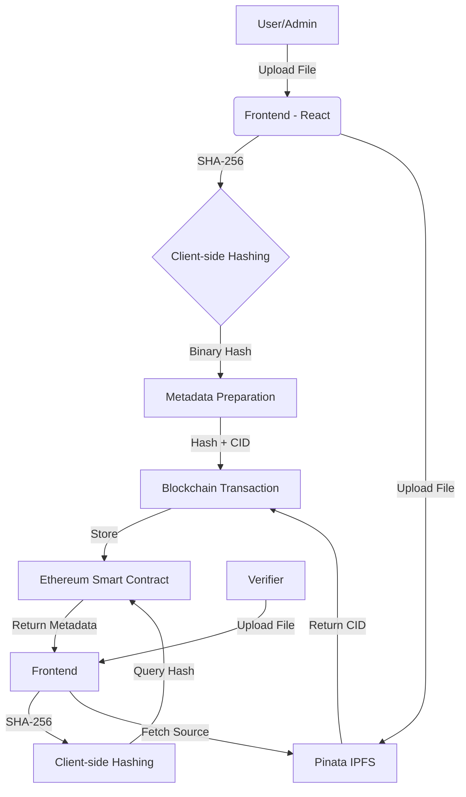

# 🎓 CertiChain: Immutable Academic Proof

CertiChain is a decentralized application (DApp) designed to eliminate credential fraud by providing a secure, verifiable, and permanent way to issue and verify academic certificates. Powered by **Ethereum** for on-chain integrity and **IPFS (via Pinata)** for decentralized storage.


## 🚀 Key Features

- **File-Based Hashing:** Generate unique SHA-256 digital fingerprints directly from original PDF/JPG documents.
- **IPFS Integration:** Decentralized storage of certificate documents using Pinata, ensuring permanent accessibility.
- **On-Chain Ledger:** Transparent and immutable records of all issued certificates stored on the Ethereum blockchain.
- **Role-Based Access Control:** Automatic detection of Admin (Issuer) and Public (Verifier) interfaces based on wallet permissions.
- **Dynamic Theming:** Seamless transition between high-contrast Light and Dark modes.
- **Instant Verification:** Rapid document authenticity checks via file upload or manual hash entry.

## 🏛️ Architectural Design

CertiChain follows a **Hybrid Decentralized Architecture**, utilizing blockchain for integrity and IPFS for storage.

### System Workflow (Mermaid)



### Technical Layers

1.  **Presentation Layer (React/Vite):** 
    -   Handles the **SHA-256 Fingerprinting** locally. The actual document content never leaves the browser until the user initiates the IPFS upload.
    -   Performs **Role Detection** by querying the smart contract to switch between Admin and Public views.

2.  **Storage Layer (IPFS/Pinata):** 
    -   Stores the heavyweight certificate files (PDFs/Images).
    -   Provides a content-addressed URI (CID) which is stored on the blockchain as a pointer to the original document.

3.  **Blockchain Layer (Solidity):**
    -   **CertificateRegistry.sol**: Acts as the single source of truth.
    -   Stores mapping of `SHA256_Hash => CertificateMetadata`.
    -   Enforces **Access Control**, ensuring only authorized addresses (Admins) can modify the registry.

4.  **Security Model:**
    -   **Collision Resistance:** Uses SHA-256 to ensure each document has a unique fingerprint.
    -   **Immutability:** Once a hash is recorded on-chain, it cannot be changed or deleted.
    -   **Integrity:** Verification works by re-hashing a document and comparing it to the on-chain record; any alteration to the document will cause the hash to mismatch.

## 🛠️ Tech Stack

- **Frontend:** React (Vite), Tailwind CSS 4.0
- **Web3:** Ethers.js v6, MetaMask SDK
- **Smart Contracts:** Solidity v0.8.27
- **Development Environment:** Foundry
- **Storage:** IPFS (via Pinata API)

## 📂 Project Structure

```text
CertificateChain/
├── certificate-frontend/    # React frontend application
│   ├── src/
│   │   ├── abi/             # Contract ABI artifacts
│   │   ├── utils/           # Web3, Hashing, and Pinata logic
│   │   └── App.jsx          # Main application logic & UI
├── my_project/              # Foundry-based smart contract project
│   ├── src/                 # Solidity source files
│   ├── test/                # Comprehensive test suite
│   └── script/              # Deployment scripts
└── .gitignore               # Root-level git configuration
```

## ⚙️ Getting Started

### Prerequisites

- [Node.js](https://nodejs.org/) (v18+)
- [Foundry](https://book.getfoundry.sh/getting-started/installation) (for contract dev)
- [MetaMask](https://metamask.io/) browser extension

### Environment Setup

Create a `.env` file in the `certificate-frontend` directory:

```env
VITE_PINATA_API_KEY=your_pinata_api_key
VITE_PINATA_API_SECRET=your_pinata_api_secret
```

### Installation

1. **Frontend:**
   ```bash
   cd certificate-frontend
   npm install
   npm run dev
   ```

2. **Smart Contracts:**
   ```bash
   cd my_project
   forge build
   forge test
   ```

## 📜 Usage

### For Administrators (Issuers)
1. Connect your authorized wallet.
2. Enter student details (Name, Reg ID, Course, Grade).
3. Upload the original certificate file.
4. Click **Issue Certificate** to pin to IPFS and record on the blockchain.

### For Public Users (Verifiers)
1. Navigate to the **Verification Center**.
2. **Option 1:** Upload the file you received. The app will automatically analyze the file's fingerprint.
3. **Option 2:** Enter the SHA-256 hash manually.
4. Click **Verify Authenticity** to see the on-chain metadata and original source.

## 🛡️ Security

This project uses **SHA-256** hashing at the binary level. Any modification to a certificate document—even a single pixel or comma—will result in a completely different hash, making the document fail verification.

---

**Developed with ❤️ for Academic Integrity.**
